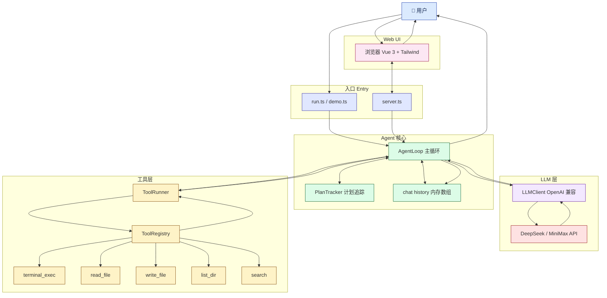
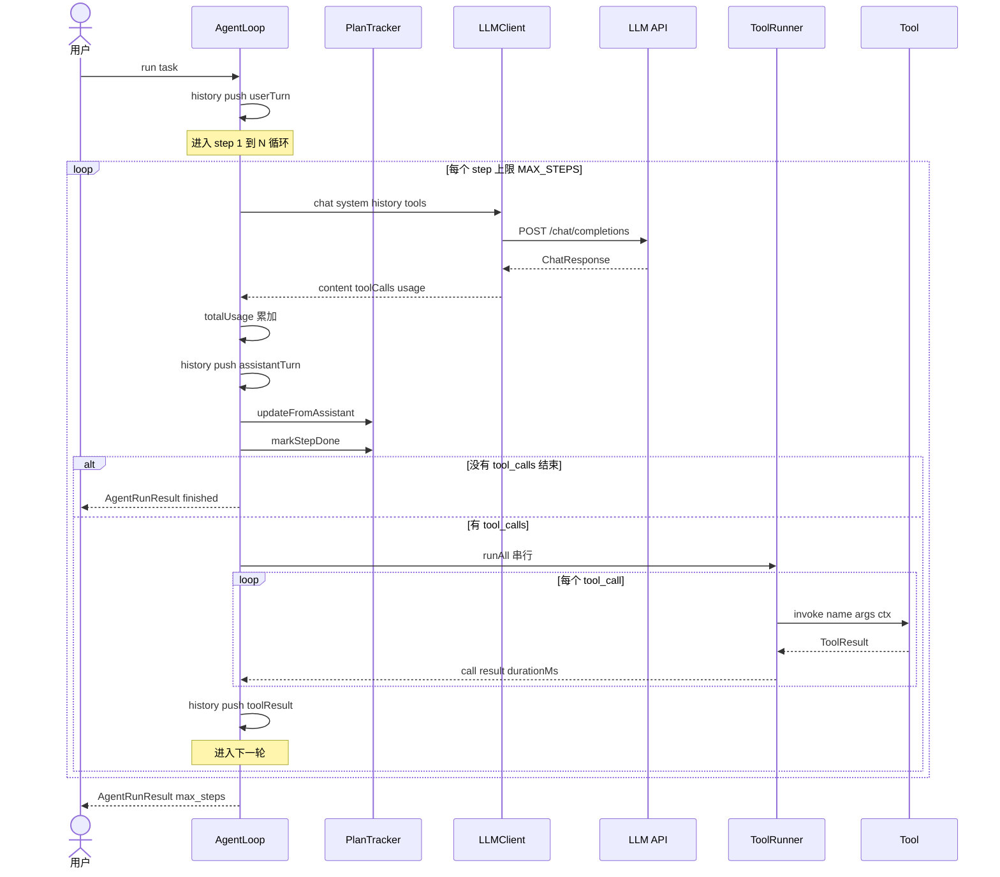

# swe-agent

极简的软件工程 agent，TypeScript 实现，约 500 行代码，零魔法，适合一口气从头读完。

> English version: [README.en.md](./README.en.md)

---

## 30 秒跑起来

```powershell
# 0. 前置：Node >= 20（package.json 的 engines 字段要求）
node -v

# 1. 装依赖
npm install

# 2. 配置 provider 和 API key
copy .env.example .env       # 然后编辑 .env，至少填一个 API key

# 3. 编译检查（确认 TypeScript 通过）
npm run typecheck

# 4. 不需要 API key 的烟囱测试（验证整个 agent 循环 + 工具）
npm run dryrun

# 5a. 命令行 demo：在一个临时目录里建一个 hello.py
npm run demo

# 5b. Web UI：浏览器里看 agent 的每一步（推荐！）
npm run web
# 然后打开 http://localhost:3000
```

如果用 `pnpm`/`yarn`，把 `npm` 替换成对应命令即可（脚本名都一样）。

---

## 三种使用方式

| 方式 | 命令 | 适合场景 |
|---|---|---|
| 命令行 demo | `npm run demo` | 第一次跑通流程 |
| 真实任务 | `npx tsx src/run.ts "任务描述"` | 一次性任务，可指定 workdir |
| Web UI | `npm run web` | 交互式，看到每一步（出错时尤其有用） |

`npm run web` 启动后访问 `http://localhost:3000`，输入任务就能看到：
- 每次 LLM 回复（assistant）
- 工具调用（tool_call，琥珀色）
- 工具结果（tool_result，绿色 ✓ / 红色 ✗）
- 最终总结（done）
- 任何错误都会用红色显式打出来

---

## 工作原理

经典 observe → think → act 循环：

1. **Plan** —— assistant 在第一轮输出 `<plan>...</plan>` 代码块，`PlanTracker` 把它存下来，每轮再塞回 system prompt
2. **Act** —— assistant 调一个或多个工具，每个调用都经过 Zod 校验、派发到 handler、结果追加到 history
3. **Observe** —— 下一轮 LLM 看到 tool 结果，决定下一步
4. **Stop** —— assistant 不再调工具时，循环结束

## 架构图

### 组件视图（数据怎么流）



### 单轮时序（一轮 observe → think → act）



---

## 项目结构

```
src/
├── config.ts            # env 加载器（LLM_PROVIDER, keys, base URL, 各种限制）
├── types.ts             # ChatMessage, ToolCall, ToolDefinition, ToolResult ...
├── agent/
│   ├── loop.ts          # observe→think→act 主循环
│   ├── scheduler.ts     # PlanTracker：<plan> 解析 + 渲染
│   └── prompt.ts        # system prompt + history 工具函数
├── llm/
│   ├── client.ts        # OpenAI 兼容客户端（DeepSeek + MiniMax 通用）
│   └── parser.ts        # 防御性 tool-call 过滤 / 文本汇总
├── tools/
│   ├── schema.ts        # Zod → OpenAI tool schema 转换
│   ├── registry.ts      # 工具注册中心（校验 + 异常包装）
│   ├── terminal.ts      # terminal_exec（spawn、捕获输出、超时 kill）
│   └── file.ts          # read_file / write_file / list_dir / search（ripgrep）
├── executor/
│   └── runner.ts        # 串行执行工具 + 计时
├── server.ts            # Web UI HTTP + SSE server
├── index.ts             # 公共 API + runTask() helper
├── demo.ts              # demo 入口
├── test/
│   └── dryrun.ts        # 脚本化端到端测试（不需要 API key）
└── public/
    └── index.html       # Web UI（Vue 3 + Tailwind，单文件）
```

---

## 支持的 LLM

两个 provider 都暴露 OpenAI 兼容 Chat Completions API，所以共用一个 `openai` SDK 客户端，靠 `baseURL` 切换。

| Provider | 默认 base URL | 默认模型 | 环境变量 |
|---|---|---|---|
| `deepseek` | `https://api.deepseek.com/v1` | `deepseek-chat` | `DEEPSEEK_API_KEY` |
| `minimax`  | `https://api.minimaxi.com/v1` | `MiniMax-Text-01`  | `MINIMAX_API_KEY`  |

在 `.env` 里设 `LLM_PROVIDER=deepseek` 或 `LLM_PROVIDER=minimax` 切换。

> **MiniMax Coding Plan 用户注意**：如果你的 key 是 `sk-cp-` 开头，需要把 `MINIMAX_BASE_URL` 设成 provider 实际下发的端点（不是 `api.minimaxi.com`），模型名也要换成该 plan 白名单里的（`MiniMax-M3` 之类）。

---

## 配置项（env-tunable）

| 变量 | 默认值 | 含义 |
|---|---|---|
| `LLM_PROVIDER` | `deepseek` | 选哪个 provider |
| `*_API_KEY` | （必填） | 对应 provider 的 key |
| `*_BASE_URL` | 见上表 | 自定义端点（MiniMax Coding Plan 用户必改） |
| `*_MODEL` | 见上表 | 模型名 |
| `MAX_STEPS` | `40` | 主循环硬上限 |
| `TOOL_TIMEOUT_MS` | `60000` | 单个工具的超时 |
| `MAX_OUTPUT_CHARS` | `50000` | 工具输出截断上限 |
| `WORKDIR` | `.` | 所有 file / terminal 操作的根目录 |

---

## 工具

| 名称 | 参数 | 作用 |
|---|---|---|
| `terminal_exec` | `{ command, max_wait_ms? }` | 跑 shell 命令，捕获 stdout+stderr，超时 kill |
| `read_file` | `{ path, start_line?, end_line? }` | 读文本文件（或一个行范围） |
| `write_file` | `{ path, content, create_dirs? }` | 覆盖写文件（可选建父目录） |
| `list_dir` | `{ path?, max_depth? }` | 列文件/目录（每行一条，`[D]`/`[F]` 前缀） |
| `search` | `{ pattern, path?, glob?, case_insensitive?, max_results?, context? }` | ripgrep 正则搜索 |

**所有 file 工具都做路径校验**：通过 `..` 或 workdir 之外的绝对路径逃逸会直接抛错。

---

## 公共 API

```ts
import {
  loadConfig, LLMClient, ToolRegistry,
  AgentLoop, buildDefaultRegistry, runTask,
} from 'swe-agent';

// 一站式：
const result = await runTask('把 foo.ts 重构成用新的 helper');

// 或者自己拼：
const cfg = loadConfig();
const client = new LLMClient(cfg);
const registry = buildDefaultRegistry();   // 装好 5 个核心工具
const agent = new AgentLoop({
  config: cfg,
  client,
  registry,
  onAssistantTurn: (r) => console.log('A:', r.content),
  onToolResult: (call, out, ok, ms) =>
    console.log(`T: ${call.name} ok=${ok} ${ms}ms`),
});
const result = await agent.run('...');
```

`AgentRunResult` 字段：`final` / `steps` / `history` / `stoppedReason`（`finished` | `max_steps` | `error`） / `totalUsage`。

---

## Web UI 的 SSE 事件

`/events` 端点推出来的事件（前端按这个渲染）：

```ts
{ type: 'start',        task, workdir, model, provider }
{ type: 'assistant',    step, content, toolCallNames }
{ type: 'tool_call',    step, name, args }
{ type: 'tool_result',  step, name, ok, output, durationMs }
{ type: 'error',        message }
{ type: 'done',         result: { stoppedReason, final, steps, usage } }
```

要加新的事件类型：`server.ts` 里加 `AgentEvent` 联合分支 + `broadcast(...)`；前端 `handleEvent` 加 case。

---

## 常见问题（Troubleshooting）

### `401 invalid api key` / `401 (2049)`

- 99% 是 `.env` 里 `LLM_PROVIDER` 和 `*_API_KEY` 不匹配（比如选了 `minimax` 但只填了 `DEEPSEEK_API_KEY`）
- 或者 PowerShell 当前 session 残留了旧 env，**优先于** `.env` 被读到。先清掉：
  ```powershell
  Remove-Item Env:DEEPSEEK_API_KEY -ErrorAction SilentlyContinue
  Remove-Item Env:MINIMAX_API_KEY -ErrorAction SilentlyContinue
  ```
- MiniMax Coding Plan (`sk-cp-...`) 必须在 `.env` 里改 `MINIMAX_BASE_URL` 和 `MINIMAX_MODEL` 到 plan 控制台给的实际值

### VS Code 报一堆 `Cannot find name 'process'`，但 `npx tsc` 干净

TS 7 Native Preview 插件的语言服务器在搞鬼，认不到 `@types/node`。
已经在 `.vscode/settings.json` 配好：
- `typescript.tsdk` 强制用工作区的 `node_modules/typescript`
- `js/ts.experimental.useTsgo: false` 关掉 TS 7 native

如果还有问题，扩展面板 → 搜 `TypeScript` → 禁用带 "7" / "native" / "tsgo" 字样的那个。

### `npm run web` 启动后白屏 / 一直转

- 打开 DevTools（F12）看 Console 报错
- 最常见：CDN 没加载成功（被网络拦了）→ 检查 `<script src="https://unpkg.com/vue@3/...">` 和 `cdn.tailwindcss.com` 能不能直接访问

### `tool_result` 全是红色（failed）

打开 UI 看具体 `error` 字段（`exit_code:1` / `timeout` / `spawn_error: ...`），不要看 final 那一行。  
`npm run demo` 跑 Vite 那种长跑进程被 kill 就属于这个——把 `MAX_STEPS` 调大、`TOOL_TIMEOUT_MS` 调长，或者任务改成像 `npm create vite@latest` 这种一次性命令。

---

## 设计取舍

- **循环单线程**：单轮内的 tool calls 串行执行。SWE 任务里大部分调用是 file/terminal 这种有状态变更的，并行的"提速"远不如"确定性"重要
- **计划存在 `<plan>` 块里**：不引入额外 schema，模型可以随时重写
- **截断的是输出，不是进程**：跑飞的 `cat` 不会让 agent OOM，进程继续但只有前 N 个字符进 prompt
- **Zod 是信任边界**：每个 tool call 派发前重新校验。LLM 不能注入 workdir 之外的路径，也不能跳过必填字段
- **Provider 只是一个 env var**：`LLM_PROVIDER=...` 一切就切，SDK 和工具协议都是一样的

---

## 没做的（保留）

- **token 级流式**：后端用非流式 chat completions，UI 收到的是事件级流。如果要 token 级，加 `stream: true` + delta 事件
- **子 agent / DAG**：单任务 plan-and-execute 够用
- **持久化**：history 在内存里，需要 resume 自己接 `JsonHistoryStore`
- **历史记录 UI**：左侧栏是 mock 占位，后端没存历史
- **取消运行**：没有 `/stop` 端点，跑起来只能等结束

---

## License

ISC（按 `package.json` 默认）
